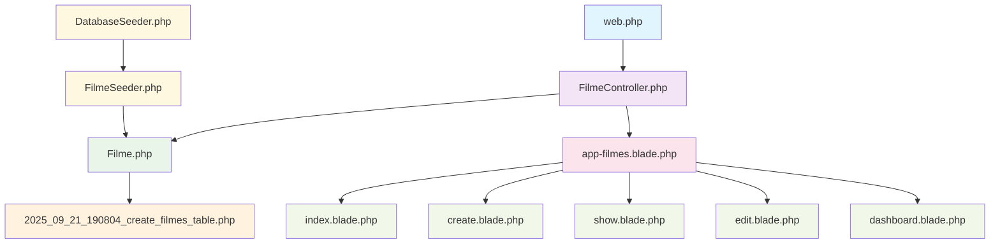
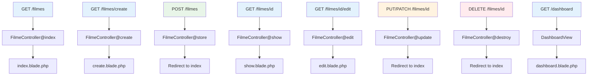
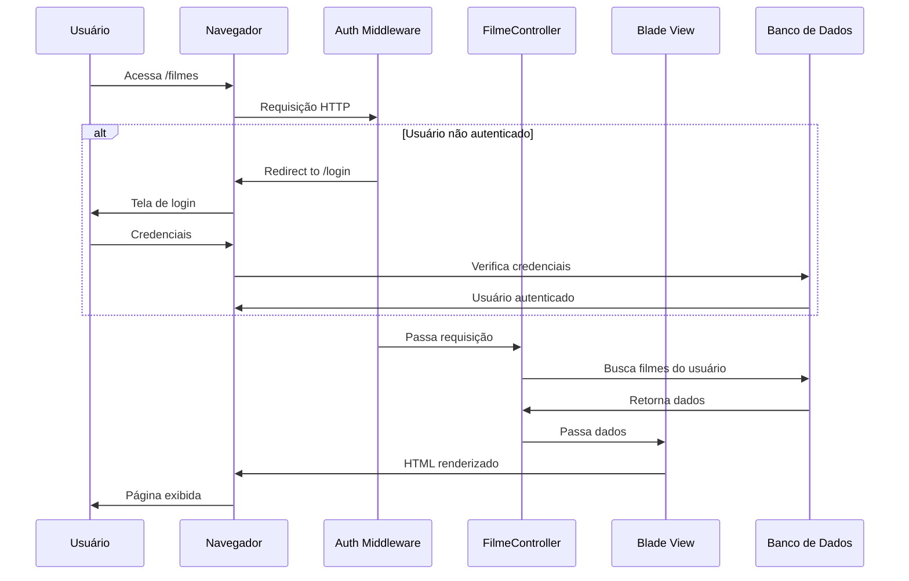
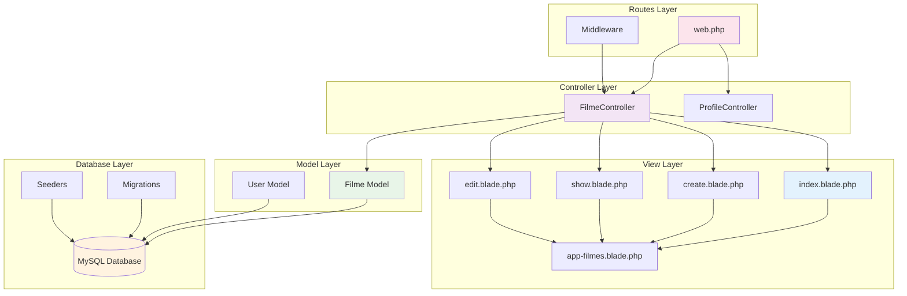
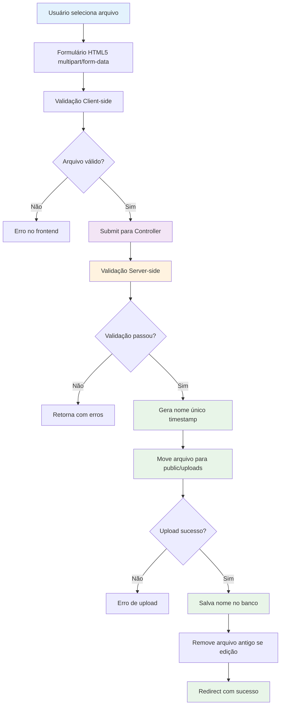
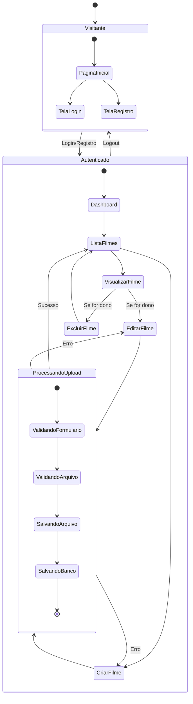

# Diagramas da Aplicação - Sistema CRUD de Filmes

Este documento contém os diagramas que explicam a arquitetura, fluxos e comunicação entre os componentes da aplicação Laravel.

## 1. Comunicação entre Arquivos do Sistema

### Explicação da Comunicação:

- **web.php (Rotas)**: Define as rotas RESTful que direcionam para o FilmeController
- **FilmeController.php**: Processa as requisições, interage com o Model e retorna as Views
- **Filme.php (Model)**: Representa a entidade filme, define relacionamentos e regras de validação
- **Migration**: Define a estrutura da tabela filmes no banco de dados
- **Layout (app-filmes.blade.php)**: Template base que é estendido por todas as views
- **Views específicas**: Herdam do layout base e implementam funcionalidades específicas
- **Seeders**: Populam o banco com dados iniciais através do Model

---

## 2. Comunicação entre Rotas e Controllers

### Explicação das Rotas:

- **GET /filmes**: Lista todos os filmes com paginação
- **GET /filmes/create**: Exibe formulário de criação
- **POST /filmes**: Processa dados do formulário e cria novo filme
- **GET /filmes/{filme}**: Mostra detalhes de um filme específico
- **GET /filmes/{filme}/edit**: Exibe formulário de edição
- **PUT/PATCH /filmes/{filme}**: Atualiza dados do filme
- **DELETE /filmes/{filme}**: Remove filme do sistema
- **Route Model Binding**: Laravel automaticamente injeta o objeto Filme nos métodos

---

## 3. Fluxo de Autenticação

### Explicação da Autenticação:

1. **Middleware Auth**: Intercepta todas as requisições para rotas protegidas
2. **Verificação de Sessão**: Checa se usuário está logado
3. **Redirecionamento**: Se não autenticado, redireciona para login
4. **Laravel Breeze**: Sistema completo de autenticação (login/registro/logout)
5. **Controle de Propriedade**: Verificação adicional se usuário é dono do recurso

---

## 4. Arquitetura MVC e Camadas

### Explicação das Camadas MVC:

- **Model (Filme.php)**: 
  - Representa dados e lógica de negócio
  - Define relacionamentos (belongsTo User)
  - Contém regras de validação
  - Interage diretamente com o banco de dados

- **View (Blade Templates)**:
  - Apresenta dados ao usuário
  - Templates reutilizáveis com herança
  - Lógica de apresentação (loops, condicionais)
  - Formulários para entrada de dados

- **Controller (FilmeController)**:
  - Recebe requisições HTTP
  - Coordena Model e View
  - Aplica regras de negócio
  - Retorna respostas apropriadas

- **Routes (web.php)**:
  - Define endpoints da aplicação
  - Aplica middleware de segurança
  - Conecta URLs aos Controllers

---

## 5. Fluxo de Upload de Imagens/Vídeos

### Explicação do Upload:

1. **Seleção**: Usuário escolhe arquivo via input file HTML5
2. **Validação Client**: JavaScript/HTML5 validation (accept attribute)
3. **Validação Server**: Laravel valida tipo, tamanho e extensão
4. **Nome Único**: `time() . extensão` evita conflitos
5. **Armazenamento**: Arquivo movido para `public/uploads/`
6. **Banco de Dados**: Apenas o nome do arquivo é armazenado
7. **Cleanup**: Remove arquivo anterior em edições
8. **Renderização**: Sistema detecta tipo (imagem/vídeo) e renderiza adequadamente

---

## 6. Estados da Aplicação

### Explicação dos Estados:

- **Visitante**: Estado inicial, acesso limitado apenas a páginas públicas
- **Autenticado**: Usuário logado com acesso completo ao sistema
- **Dashboard**: Página inicial com resumo e navegação
- **Lista Filmes**: Visualização paginada de todos os filmes
- **Criar/Editar**: Formulários para manipulação de dados
- **Visualizar**: Detalhes completos de um filme específico
- **Processando Upload**: Estado transitório durante operações de arquivo
- **Controle de Propriedade**: Apenas o dono pode editar/excluir seus filmes

### Transições de Estado:

1. **Login/Registro**: Transição de Visitante para Autenticado
2. **Navegação**: Movimentação entre diferentes seções da aplicação
3. **CRUD Operations**: Criação, leitura, atualização e exclusão de filmes
4. **Logout**: Retorno ao estado de Visitante
5. **Validação**: Estados de erro retornam ao formulário com feedback

---

## Considerações Técnicas

### Segurança:
- Middleware `auth` protege todas as operações
- CSRF tokens em todos os formulários
- Validação de propriedade antes de editar/excluir
- Upload restrito a tipos específicos de arquivo

### Performance:
- Eager loading (`with('user')`) evita queries N+1
- Paginação limita registros por página
- Arquivos armazenados no sistema de arquivos local

### Manutenibilidade:
- Arquitetura MVC bem definida
- Separação de responsabilidades
- Templates reutilizáveis
- Validação centralizada no Model
- Rotas RESTful padronizadas